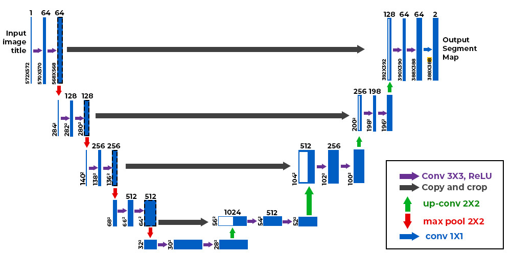

# Rust Detection CNN Classifier

A deep learning application that uses a Convolutional Neural Network (CNN) to detect rust in images. The project includes both a training module and a user-friendly GUI application for making predictions.

## Features

- CNN model built with PyTorch
- Training on the Corrosion_Rust dataset
- Real-time predictions through a drag-and-drop interface
- Model checkpoint saving and loading
- Confidence scores for predictions

## Installation

1. Clone this repository
2. Install the required dependencies:
   ```bash
   pip install -r requirements.txt
   ```

## Project Structure

- `classifier.py`: CNN model definition and training code
- `predict_app.py`: GUI application for making predictions
- `requirements.txt`: List of Python dependencies
- `best_model.pth`: Trained model checkpoint (created after training)

## Usage

### Training the Model

1. Run the training script:
   ```bash
   python classifier.py
   ```
2. The best model will be automatically saved as `best_model.pth`

### Making Predictions

1. Run the prediction application:
   ```bash
   python predict_app.py
   ```
2. Drag and drop any image onto the application window
3. The prediction result and confidence score will be displayed

## Model Architecture

The CNN model consists of:
- 3 convolutional layers with ReLU activation and max pooling
- Fully connected layers with dropout for regularization
- Output layer for binary classification (Rust/No Rust)

## Dataset

The model is trained on the [Corrosion_Rust dataset](https://huggingface.co/datasets/BinKhoaLe1812/Corrosion_Rust) from Hugging Face, which contains images of rusted and non-rusted surfaces.

## Requirements

- Python 3.9+
- PyTorch
- torchvision
- PIL (Pillow)
- tkinterdnd2
- datasets (Hugging Face)
²
## Future Work

Segmentation instead of labelling using UNET architecture


UNET network is made of several stack of convolution with a pooling layer to reduce dimension between them. Each convolution layers are able to extract information and are called feature maps.

The encoder layers are concatenated with the decoder layers. What does this design choice bring to the system?
1. Recovering spatial information : counter the loss of fine details information such as edges, textures or boundaries
2. Combining High Level and Low Level features
   Encoder tends to capture low level features (edges and textures)
   Decoder tends to capture high level and abstract (semantic information)
   By combinating the two the networkds combines both
3. Improved gradient flow : helps to banish vanishing gradient problem (I do not exactly see how, go deeper on that topic)
4. Help reconstruction during the decoder path (images would be less blury)

Reflection about kernel and stride:
small kernel sees more details, bigger kernel capture global feature but are more expensive.
small  stride also capture more details but requires higher computation

## License

This project is open-source and available under the MIT License.
